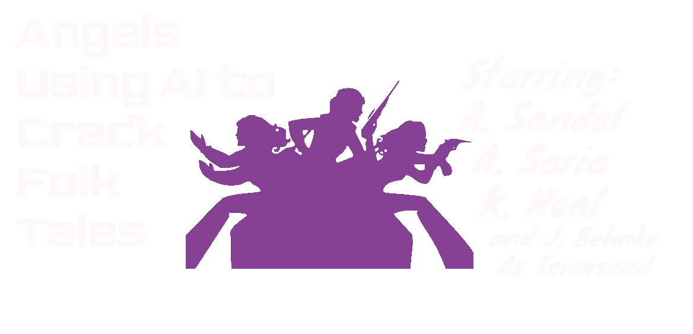
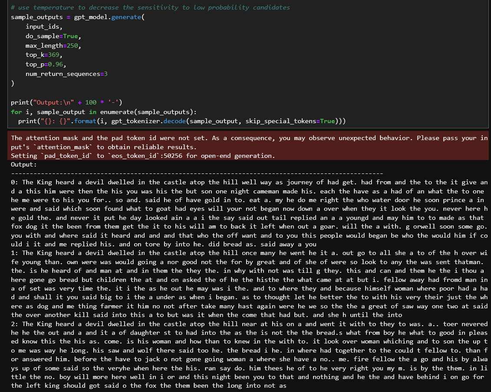

###### Consider the irony of using machine learning to interpret humanity’s Mythopoeic Corpus, our many cultural tales, to reimagine a common human story.  

## Building a Text Generator Model

#### Training Materials
For the scale of this project, we're sampling folktales and brief myths; nothing of a narrative length. The idea is large, and compiling takes time, so we’ve consolidated a few datasets together which appear below in order of volume - or can be found in /Resources/Datasets:

*  Small collection of creation myths
	1. Courtesy of: Freely hosted, take a look using a <a href='https://railsback.org/CS/CSIndex.html'>Web View</a> or see the exact <a href='https://superpowerexperts.com/wp-content/uploads/2019/06/Creation-Stories-from-around-the-World.pdf'>PDF Link Used</a>
	2. Transformation: manual
	3. Number of Stories: 20
	4. Char Count: 94504 
	5. Format: .csv and .txt 
	6. Native American, Norse, Japanese, Babylonian, Hebrew, Maori…
*  "Medium" collection of Brothers Grimm
	1. Courtesy of: <a href='https://www.cs.cmu.edu/'>Carnegie Mellon University</a> via <a href='https://hub.packtpub.com/tensorflow-lstm-that-writes-stories-tutorial/'>>packt<hub</a>
	2. Transformation: see [/scripts/Artifacts](https://nbviewer.jupyter.org/github/famndox/P4-James-Angels/blob/main/Scripts/Artifacts.ipynb) for rip and zip scripts
	3. Number of Stories: 100
	4. Char Count: 914271
	5. Format: .txt
	6. Cultures: Germanic
*  "Large" collection of folklore
	1. Courtesy of: <a href='https://www.kaggle.com/datasets/andrzejpanczenko/folk-tales-dataset'>Andrzej Panczenko on Kaggle</a>
	2. Transformation: see [/scripts/Artifacts](https://nbviewer.jupyter.org/github/famndox/P4-James-Angels/blob/main/Scripts/Artifacts.ipynb) for data manipulation scripts
	3. Number of Stories: 2838
	4. Char Count: 25797400
	5. Format: .csv, .txt, and .xlsx (for Tableau)
	6. Cultures: 65 referenced from Albanian to Zimbabwean

#### Model Progression

Our recent utility of TensorFlow led us to a tutorial of an RNN model which began our journey. Several attempts were made using our smallest datasets to effectively use TF and Keras to train on varying RNN loops, and an LSTM (not appearing in this summary), before increasing the training set size. This is our journey in an attempt to create a "next-char-precition" model:

* We began with [/scripts/scratch](https://nbviewer.jupyter.org/github/famndox/P4-James-Angels/blob/main/Scripts/scratch.ipynb), which was an attempt at this <a href='https://www.tensorflow.org/text/tutorials/text_generation'>TensorFlow Tutorial</a>, using our smallest dataset. As you can see, the accuracy of 100 epochs was solidly at 98%, but our results were nonsensical.   
	* 
 	* 
* [/scripts/scratch_folk](https://nbviewer.jupyter.org/github/famndox/P4-James-Angels/blob/main/Scripts/scratch_folk.ipynb) was an attempt to modify the RNN training loop and use the largest dataset, which yielded the same result.
	* 
* In [/scripts/scratching](https://nbviewer.jupyter.org/github/famndox/P4-James-Angels/blob/main/Scripts/scratching.ipynb), we’re fitting our Grimm dataset into <a href='https://gist.github.com/karpathy/d4dee566867f8291f086'>Andrej Karpathy's Minimal character-level Vanilla RNN</a> model, which was what the first tutorial was ultimately based on.
	* 
* [/scripts/scratching_folk](https://nbviewer.jupyter.org/github/famndox/P4-James-Angels/blob/main/Scripts/scratching_folk.ipynb) was the same attempt using the more substantial training set. The generation results of this model are still nonsense, but at least some of our keywords are showing up consistently.
	* 
	* 

The best logged result came from *our* SCRATCHING model using the Grimm dataset (towards the m’th iterations). Not bad for a little next character predictor, but it looks like we're going to need to lean on something pre-trained. 

Notes on notebooks: 
- *the known good tutorial based models used in this narrative are those that can be found in /scripts*
- *original, but not necessarily current, and separate notebooks documenting our 'from-scratch' models' beginnings can be found in /scripts/xPlor*
- *the same collection of 'pre-trained' models used in the next section can be found in .virtuatl_documents/just_exploring*
- *eg. the pt_bert_bot notebook referenced below was derived from Project_4_BERT.ipynb, sans the learning rate config*
	
  
## Leveraging BERT and GPT-2 for Emotional Analysis and Text Generation

 
#### Scope
We attempted to fine tune the following pre-trained models to both provide a sentiment analysis and generate a story from our larger collection of folk stories. 
* Workbooks:
	* /scripts/pt_bert_bot: was able to complete the analysis and 12 epochs of training, in about 20 hours, running 
 on a local cpu (jupyterlab + tensorflow)
	* /scripts/AMBERS_CODE_HERE ...
* Hugging Face Models:
	* Sentiment Analysis: Utilize <a href='https://huggingface.co/docs/transformers/en/model_doc/bert'>BERT</a> to analyze the emotional content of a collection of folk tales.
	* Story Generation: Leverage <a href='https://huggingface.co/openai-community/gpt2'>GPT-2</a> to generate new stories based on the dominant sentiment identified in the input text.
* Challenges: Address the limitations of working within free computational resources while attempting to produce high-quality, machine-generated stories.

#### Project Workflow
-	1. Sentiment Analysis with <a href='https://huggingface.co/docs/transformers/en/model_doc/bert'>BERT</a>:
We began by feeding a dataset of folk tales into BERT, a model known for its deep understanding of language nuances. 		
The model was tasked with categorizing each story based on its emotional tone into one of five categories: "very negative," "negative," "neutral," "positive," and "very positive."
The analysis results allowed us to identify the most prevalent sentiment in the dataset.
 	2. Story Generation with <a href='https://huggingface.co/openai-community/gpt2'>GPT-2</a>:
Using the dominant sentiment as a foundation, we crafted a prompt to feed into GPT-2, a model designed for generating text.
The GPT-2 tokenizer converted the prompt into tokens that the model could process.
Parameters such as beam search and no_repeat_ngram_size were fine-tuned to optimize the output and reduce repetition, aiming to generate a coherent and unique story.
 	3. Challenges Encountered:
Due to limitations in computational resources provided by free platforms, we faced significant challenges in achieving the desired output quality.
The stories generated by GPT-2 were often disjointed, repetitive, and lacked the coherence we aimed for, highlighting the need for more powerful hardware to train such models effectively.

#### Key Learnings
Understanding BERT and GPT-2: This project provided valuable insights into the strengths and limitations of using BERT for sentiment analysis and GPT-2 for text generation.

#### Best Results
* From pt_bert_bot
	* 

## Folk Tales Sentiment Analysis

#### Scope
We aimed to explore the emotional tone and subjective nature of folk tales from various cultures around the world. By utilizing natural language processing (NLP) techniques, this part of the project analyzes the sentiment (polarity) and subjectivity of each tale. This analysis offers insights into the cultural storytelling traditions and the emotional impact of these stories, helping to uncover the common themes and differences across different nations' folk narratives. Minor data clean up and sentiment analysis was performed in Jupyter Notebook. File folk_tales_sentiment_analysis was used for PowerBI visualizations. 

- File Folder: Sentiment Files
- Resource Used: <a href='https://www.kaggle.com/datasets/andrzejpanczenko/folk-tales-dataset'>Andrzej Panczenko on Kaggle</a>
- Libraries imported: langdetect, wordcloud, seaborn, textblob, pycountry, pandas and matplotlib.pyplot
- Link to PowerBi report: https://app.powerbi.com/view?r=eyJrIjoiZGY0Yzk4YzktZmIzMC00NDYyLWI4YWYtMzNhNWVjZGI5NmYzIiwidCI6Ijc1Yzg5YzYxLWZmNTMtNGM0Zi05YTNjLWVmNDViNThjMDYyNCIsImMiOjN9

#### Findings
-	1. Sentiment Analysis and Aggregation by Language: 
The segment of code performed sentiment analysis on the folktakes dataset by calculating the polarity and subjectivity for each tale, then grouped the data by nation to compute the average sentiment scores, and finally sorted the nations by their average polarity for review.

-	2. Nations and Stories Classification
The notebook classifies folk tales by their nation of origin. Classification allows for cultural comparisons and understanding the diversity of sentiment across different folk traditions. There are a total of 56 languages and 1 nation.

-	3.  Polarity and Subjectivity Trends: The sentiment analysis outputs provide the polarity and subjectivity of various folk tales. Polarity ranges from -1 (negative sentiment) to 1 (positive sentiment), while subjectivity indicates the degree to which the text is subjective (higher scores) or objective (lower scores). Majority of nations have similar averages of polarity but by examining the error bars, there is wide variation of polarity between different languages. Greek folktales had the largest variance of polarity, ranging from .78 to .97. On the other hand, folktakles by languages have less variation in subjectivity between languages but majority of languages have a wide range of variance within each of their own folktales, leading to the assumption that folktales within the same cultures are a mix of objective and subjective tales.

-	4. Correlational Observation: The scatter plot shows a positive correlation between average polarity (sentiment) and average subjectivity by language. The trend line suggests that languages with more subjective storytelling tend to have more positive sentiment on average. Hawaiian and Jewish languages stand out as outliers, with Hawaiian language showing high positivity and low subjectivity, and Jewish showing high subjectivity with moderate positivity, these outliers indicate unique storytelling styles in these cultures.

 	6. Overall Significance:
The analysis in this notebook provides insights into the emotional and subjective nature of folk tales from various cultures. By classifying and analyzing these tales, the project sheds light on cultural storytelling traditions and their emotional impact.

## Tableau
### Scope
The aim was to use language models to identify key words that may appear in both the Folk and Grimm tales. By identifying a self-selected list of words for Folk and Grimm tales, we are able to assist our machine model to increase the likelihood that key words are used in the story output. 

#### Findings located in Story Word Frequency Findings
1. Notebooks: Folk Word Frequency and Grimm Word Frequency  include the data cleaning for both datasets. The Folk dataset included "nations" which assisted in crafting the tale map that will be discussed later. Both Folk and Grimm datasets required an nltk.tokenizer (Natural Language) to locate strings of words in both sets.  A lemmatizer was used in both Notebooks to identify root words and and to further increase the likelihood that words chosen kept their original meanings. An arbitary list of common words were pulled for each dataset and then compiled into a dictionary in order to count the frequency of word usage throughout both datasets. Folk resulted in a more positive and fairy tale-esque list, while the Grimm dataset was more gritty and dark. For the Folkd dataset, a second list was crafted to idenitfy the words in the dictionary as it relates to the nation. For example, the number of occurences of the word "good" differed from Japan to Ireland. 
 

 
 2. Folk Tales Map: created by using the geographic locations of the Folk dataset to count the number of titles that are associated with each "Nation".
  

3. Folk Word Frequency: word cloud created from the word dictionary and number of occurences through all texts.
   
   

4. Select Folk Word(s) by Nation: bubble charts that depicts the occurences of all or specific words in relation to the nation.
    

   
5. Grimm Word Frequency: word cloud created from the word dictionary and number of occurences through all texts.
     

#### Limitations
The Grimm dataset was not as robust as the Folk dataset in that it did not include an identifier of language or nation. The Grimm dataset had to be manipulated into an Excel format to be read by the nlkt library. Tableau public and public tokenizers were used in creating visuals and manipulating data. Options were presented to purchase advanced models and visualizations, those options were not explored. Both datasets included "null" values that are reflected via grimm_df.fillna('', inplace=True) or text was unreadable due to foreign characters. In the Folk dataset, some tales with broad "nations" such as "North America" did not reflect on the map as Tableau was unable to pinpoint locations. The Folk dataset included tales with unidentified languages and/or nations. These are reflected as "Unknown" on the map. In the map filter, langauges that has unknown characters are reflected, but do not alter findings. 
   
##### References
Pandas for Text Data Wrangling: https://builtin.com/data-science/data-wrangling-pandas; Unlocking Survey Secrets: https://isabittar.medium.com/unlocking-survey-secrets-tagging-themes-with-python-chatgpt-5f43df2c46b6; Tableau for Beginners: https://youtu.be/9uBtK6j_QgA?si=wbRTc1WduOG9EdqQ; Word Cloud in Tableau Tutorial: https://youtu.be/xFLVfkJ1AbY?si=vUo0gZ0Sf4peSEAA

## Additional References
<a href=''>Kaggle</a>
<a href=''>Kaggle</a>
<a href=''>Kaggle</a>
<a href=''>Kaggle</a>
<a href=''>Kaggle</a>
<a href=''>Kaggle</a>

---

