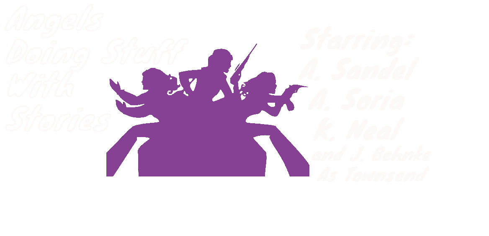
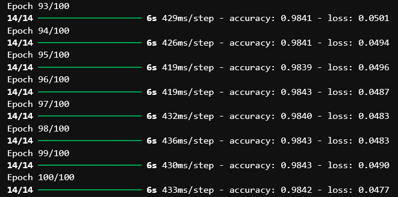
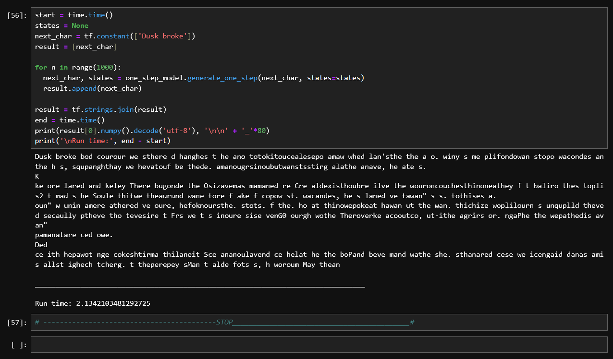
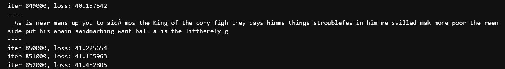
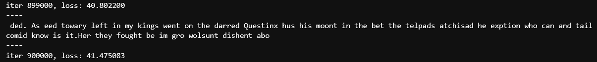
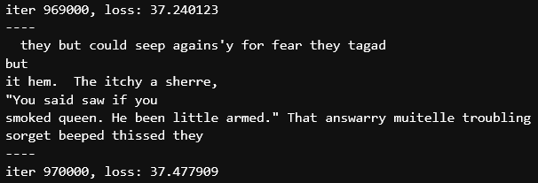

Consider the irony of using machine learning to interpret humanity’s Mythopoeic Corpus, our many cultural tales, to reimagine a common human story.  For the scale of this project, we're sampling folktales and brief myths; nothing of a narrative length.

## Building a Text Generator Model

#### Training Materials
The idea is large, and compiling takes time, so we’ve consolidated a few datasets together which can be found in /Resources/Datasets:

*  Tiny collection of creation myths
	1. Courtesy of: Freely hosted, take a look using a <a href='https://railsback.org/CS/CSIndex.html'>Web View</a> or see the exact <a href='https://superpowerexperts.com/wp-content/uploads/2019/06/Creation-Stories-from-around-the-World.pdf'>PDF Link Used</a>
	2. Transformation: manual
	3. Number of Stories: 20
	4. Char Count: 94504 
	5. Format: .txt and .csv
	6. Native American, Norse, Japanese, Babylonian, Hebrew, Maori…
*  Small collection of Brothers Grimm
	1. Courtesy of: <a href='https://www.cs.cmu.edu/'>Carnegie Mellon University</a> via <a href='https://hub.packtpub.com/tensorflow-lstm-that-writes-stories-tutorial/'>>packt<hub</a>
	2. Transformation: see Artifacts for rip and zip scripts
	3. Number of Stories: 100
	4. Char Count: 914271
	5. Format: .txt and .csv
	6. Cultures: Germanic
*  Decent collection of folklore
	1. Courtesy of: <a href='https://www.kaggle.com/datasets/andrzejpanczenko/folk-tales-dataset'>Andrzej Panczenko on Kaggle</a>
	2. Transformation: see Artifacts for rip and zip scripts
	3. Number of Stories: 2838
	4. Char Count: 25797400
	5. Format: .csv
	6. Cultures: 65 referenced from Albanian to Zimbabwean

#### Model Progression

We began with SCRATCH, which was an attempt at this <a href='https://www.tensorflow.org/text/tutorials/text_generation'>TensorFlow Tutorial</a>, using our smallest dataset. As you can see, the accuracy of 100 epochs was solidly at 98%, but our results were nonsensical.   
SCRATCH_FOLK was an attempt to perform the same RNN model on the largest dataset with the same result. 
In SCRATCHING, we’re forcing our dataset into Andrej Karpathy (@karpathy) Minimal character-level Vanilla RNN model which was what the above tutorial was ultimately based on. Scratching_folk was the same attempt using the more substantial training set. At least some of our keywords are showing up consistently. Of course you can see the results are still nonsense:
* 
* 

Ultimately the best logged result came from the original grimm dataset towards the m’th iterations. Not bad for a little next character predictor. 
* 

  
## Leveraging BERT and GPT-2 for Emotional Analysis and Text Generation

- File Folder: .virtual_documents/just_exploring (Need to update and clear old files)
#### Scope
Sentiment Analysis: Utilize BERT to analyze the emotional content of a collection of folk tales.

Story Generation: Leverage GPT-2 to generate new stories based on the dominant sentiment identified in the input text.

Challenges: Address the limitations of working within free computational resources while attempting to produce high-quality, machine-generated stories.

#### Project Workflow
-	1. Sentiment Analysis with BERT:
We began by feeding a dataset of folk tales into BERT, a model known for its deep understanding of language nuances.
The model was tasked with categorizing each story based on its emotional tone into one of five categories: "very negative," "negative," "neutral," "positive," and "very positive."
The analysis results allowed us to identify the most prevalent sentiment in the dataset.
- 	2. Story Generation with GPT-2:
Using the dominant sentiment as a foundation, we crafted a prompt to feed into GPT-2, a model designed for generating text.
The GPT-2 tokenizer converted the prompt into tokens that the model could process.
Parameters such as beam search and no_repeat_ngram_size were fine-tuned to optimize the output and reduce repetition, aiming to generate a coherent and unique story.
- 	3. Challenges Encountered:
Due to limitations in computational resources provided by free platforms, we faced significant challenges in achieving the desired output quality.
The stories generated by GPT-2 were often disjointed, repetitive, and lacked the coherence we aimed for, highlighting the need for more powerful hardware to train such models effectively.

#### Key Learnings
Understanding BERT and GPT-2: This project provided valuable insights into the strengths and limitations of using BERT for sentiment analysis and GPT-2 for text generation.

## Folk Tales Sentiment Analysis
- File Folder: Sentiment Files
- Resource Used: <a href='https://www.kaggle.com/datasets/andrzejpanczenko/folk-tales-dataset'>Andrzej Panczenko on Kaggle</a>
- Libraries imported: langdetect, wordcloud, seaborn, textblob, pycountry, pandas and matplotlib.pyplot
#### Scope
We aimed to explore the emotional tone and subjective nature of folk tales from various cultures around the world. By utilizing natural language processing (NLP) techniques, this part of the project analyzes the sentiment (polarity) and subjectivity of each tale. This analysis offers insights into the cultural storytelling traditions and the emotional impact of these stories, helping to uncover the common themes and differences across different nations' folk narratives.
#### Findings
-	1. Nations and Stories Classification
The notebook classifies folk tales by their nation of origin. Classification allows for cultural comparisons and understanding the diversity of sentiment across different folk traditions.
-	2. The sentiment analysis outputs provide the polarity and subjectivity of various folk tales. Polarity ranges from -1 (negative sentiment) to 1 (positive sentiment), while subjectivity indicates the degree to which the text is subjective or objective.
For instance, the tale "Momotaro" from Japan has a positive polarity of approximately 0.24 and a moderate subjectivity of 0.45. This suggests that the story is somewhat positive and moderately subjective.
-	3. Data Table Summaries: 
The data tables in the notebook contain columns such as source, nation, title, text, polarity, and subjectivity. These tables summarize the key attributes of the folk tales analyzed, including their emotional tone and the degree of personal opinion or factual content.
-	4. Polarity and Subjectivity Trends:
The summary outputs highlight patterns in polarity and subjectivity across different nations. This can be significant for understanding the emotional and narrative styles prevalent in folk tales from different cultures.
-	5. Overall Significance:
The analysis in this notebook provides insights into the emotional and subjective nature of folk tales from various cultures. By classifying and analyzing these tales, the project sheds light on cultural storytelling traditions and their emotional impact.

## Tableau

## References

<a href='https://link_sample'>Copy Me</a>
<a href=''>Copy Me</a>
<a href=''>Copy Me</a>

---
sharing, but so far just an attempt at a TensorFlow tutorial using RNN layer - https://www.tensorflow.org/text/tutorials/text_generation

next step is to do the tutorial using the LSTM layter model from <packt> - https://hub.packtpub.com/tensorflow-lstm-that-writes-stories-tutorial/

note the code for the above can be found here: https://github.com/PacktPublishing/Natural-Language-Processing-with-TensorFlow/blob/master/ch8/lstms_for_text_generation.ipynb

however, I'm running into issues because it's using an older rev of TF, updating w/o comprehension is difficult

...

see gdoc for notes
